# Cut plan: 85 → 70 kg by spring

Target loss is about 0.55–0.6 kg/week.

Protein is fixed at **160 g/day**. Carbs are **75 g on rest days** and **+120 g per riding hour**, eaten around the ride. Fat fills the rest of the calories and shrinks as RMR drops.

## Daily macros by weight

Stacked bars, kcal/day. Colors: blue = protein, yellow = carbs, orange = fat (top of bar = total).

```mermaid
%%{init: {"themeVariables": {"xyChart": {"plotColorPalette": "#eb6834, #eda100, #2a78d6"}}}}%%
xychart-beta
  title "Rest day"
  x-axis ["85 kg", "80 kg", "75 kg", "70 kg"]
  y-axis "kcal" 0 --> 3200
  bar [1750, 1696, 1624, 1552]
  bar [940, 940, 940, 940]
  bar [640, 640, 640, 640]
```

```mermaid
%%{init: {"themeVariables": {"xyChart": {"plotColorPalette": "#eb6834, #eda100, #2a78d6"}}}}%%
xychart-beta
  title "1 h ride"
  x-axis ["85 kg", "80 kg", "75 kg", "70 kg"]
  y-axis "kcal" 0 --> 3200
  bar [2230, 2176, 2104, 2032]
  bar [1420, 1420, 1420, 1420]
  bar [640, 640, 640, 640]
```

```mermaid
%%{init: {"themeVariables": {"xyChart": {"plotColorPalette": "#eb6834, #eda100, #2a78d6"}}}}%%
xychart-beta
  title "2 h ride"
  x-axis ["85 kg", "80 kg", "75 kg", "70 kg"]
  y-axis "kcal" 0 --> 3200
  bar [2710, 2656, 2584, 2512]
  bar [1900, 1900, 1900, 1900]
  bar [640, 640, 640, 640]
```

```mermaid
%%{init: {"themeVariables": {"xyChart": {"plotColorPalette": "#eb6834, #eda100, #2a78d6"}}}}%%
xychart-beta
  title "3 h ride"
  x-axis ["85 kg", "80 kg", "75 kg", "70 kg"]
  y-axis "kcal" 0 --> 3200
  bar [3190, 3136, 3064, 2992]
  bar [2380, 2380, 2380, 2380]
  bar [640, 640, 640, 640]
```

| Weight | Fat (g) | Rest | 1 h | 2 h | 3 h |
|---|---|---|---|---|---|
| Carbs (g) | | 75 | 195 | 315 | 435 |
| 85 kg | 90 | 1750 kcal | 2230 kcal | 2710 kcal | 3190 kcal |
| 80 kg | 84 | 1696 kcal | 2176 kcal | 2656 kcal | 3136 kcal |
| 75 kg | 76 | 1624 kcal | 2104 kcal | 2584 kcal | 3064 kcal |
| 70 kg | 68 | 1552 kcal | 2032 kcal | 2512 kcal | 2992 kcal |

Protein is 160 g on every day.

## Protein sources

| Food | Protein | Notes |
|---|---|---|
| Chicken / turkey breast | ~23 g per 100 g raw | Cheapest lean staple |
| Lean beef (5% fat) | ~21 g per 100 g | Iron, B12 |
| Cod, pollock, canned tuna | ~18–25 g per 100 g | Very lean |
| Salmon, mackerel | ~20 g per 100 g | Omega-3; counts toward fat |
| Eggs | ~6 g per egg | Whole eggs count toward fat; mix in whites |
| Skyr / low-fat varškė | ~11–18 g per 100 g | Best snack protein |
| Cottage cheese | ~11 g per 100 g | Good before bed |
| Whey | ~20–25 g per scoop | Post-ride, or to top up |
| Lentils, chickpeas | ~7–9 g per 100 g cooked | Also slow carbs and fiber |

## Carb sources

**Rest days (low, slow, high fiber):** vegetables of all kinds, berries, apples, lentils and beans, a small portion of oats or rye bread.

**Around rides (fast, easy to digest):** rice, potatoes, oats, white or rye bread, bananas, dates, honey, rice cakes. During the ride: gels, sports drink, or bars.

**Fats:** olive oil, nuts, avocado, eggs, fatty fish.

## Example meals

### Rest day (~1750 kcal, 160 P / 75 C / 90 F)
- **Breakfast:** 3 eggs and 100 g egg whites, scrambled in 10 g butter, with spinach and tomatoes
- **Lunch:** 200 g chicken breast, big salad, 15 ml olive oil, 100 g chickpeas
- **Snack:** 200 g skyr, 100 g berries, 15 g walnuts
- **Dinner:** 200 g salmon, roasted broccoli and zucchini, small side of lentils

### 2 h ride day (~2700 kcal, 160 P / 315 C / 90 F)
- **Breakfast (2–3 h before):** 80 g oats, banana, honey, 200 g skyr
- **During the ride:** about 60–80 g carbs per hour (gels, drink, rice cakes)
- **After the ride:** whey shake, 2 slices of bread with jam
- **Lunch:** 200 g chicken, 100 g rice (dry weight), vegetables
- **Dinner:** 200 g lean beef, 300 g potatoes, salad with olive oil

## Rules
- Weigh yourself every morning and track the weekly average. Adjust every 2 weeks:
  - Losing less than 0.3 kg/week: cut 100–150 kcal.
  - Losing more than 0.8 kg/week, or legs feel dead: add about 200 kcal.
- Keep strength training 1–2 times a week.
- Consider a 1–2 week maintenance break at about 78 kg.
